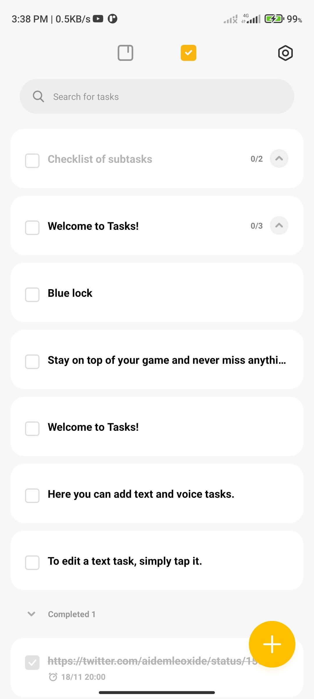

## React Task App
#### Link to the live website: [Task App](http://react-task-avmwpv1c9-fatscythe.vercel.app/ "task app live site")
___

### Description 
A task webapp made with react for adding task, it can search throught the list, can add new task, edit task, show completed task, store list in local storage and more. It bears resemblance to the task app on my phone, i was inspired to do this to see how well i have gotten in react
____

### Tech Used:
1. React
2. Git
3. Github
4. Vercel
5. React
___
### Design
The desgn was gotten from a screenshot of my phone to-do app

### Available Scripts

In the project directory, you can run:

### `npm start`

Runs the app in the development mode.\
Open [http://localhost:3000](http://localhost:3000) to view it in your browser.

The page will reload when you make changes.\
You may also see any lint errors in the console.

### Credits: 
1. [Scythe](https://twitter.com/holadhayo "Abdullahi Fahm")
